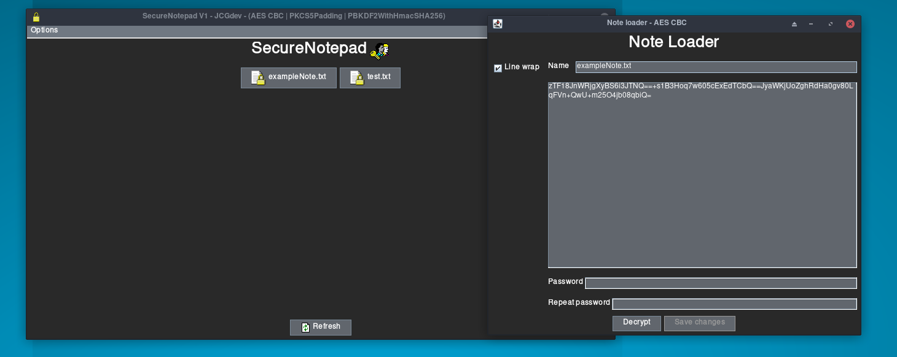

# secureNotepad

A notepad with AES integration, written in Java

## Table of contents
* [General info](#general-info)
* [Setup](#setup)
* [TODO](#TODO)

## General info

>- In this proyect, AES CBC is the encryption method. There is an obfuscation method: 

>- Furthermore, there is an obfuscation method, PBKDF2 key derivation (With HMAC Sha256). Password is hashed 65.000 times

>- The notes created with this program, will follow this order:

>- [ Salt - IV - Ciphertext ]

## Setup

>- When executing the program, an config file be created. It's stored in:

>- Linux --> ~/.config/secureNotepad/config.conf

>- Windows --> C:\\Users\\USER\\AppData\\Local\\secureNotepad\\config.conf

## TODO

>- Add icons and dark mode

>- Improve functionality

